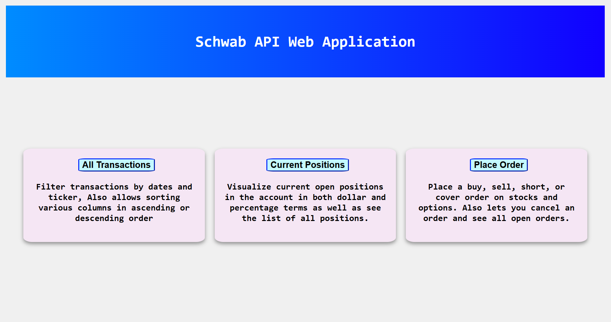
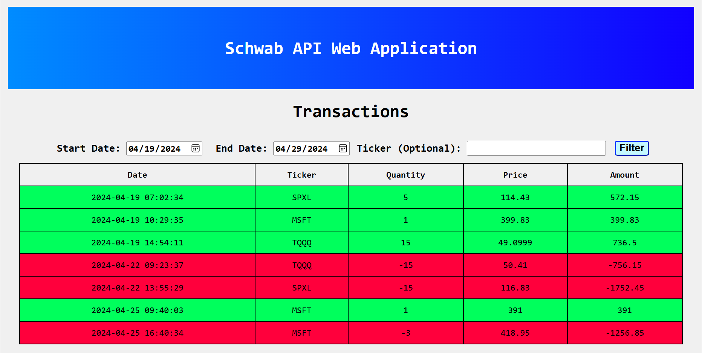
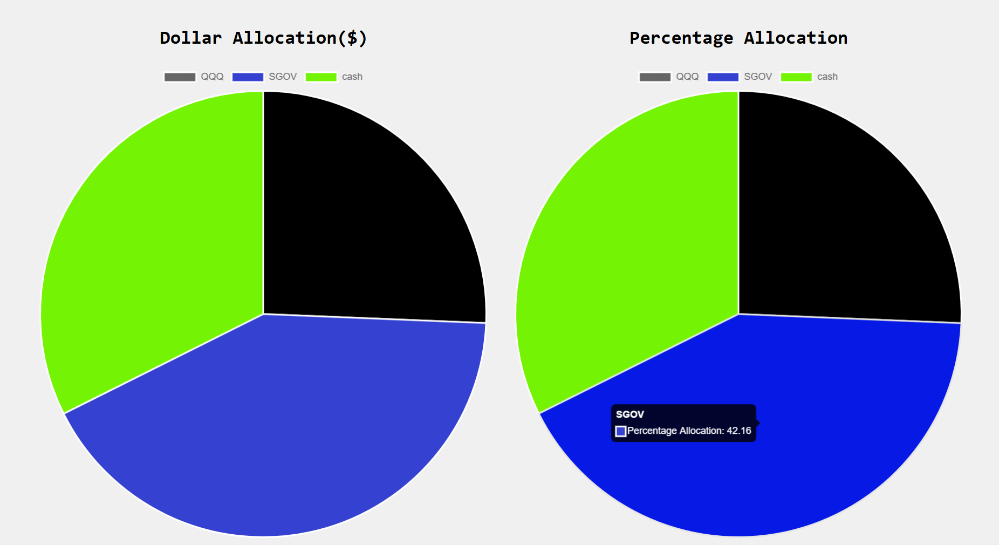
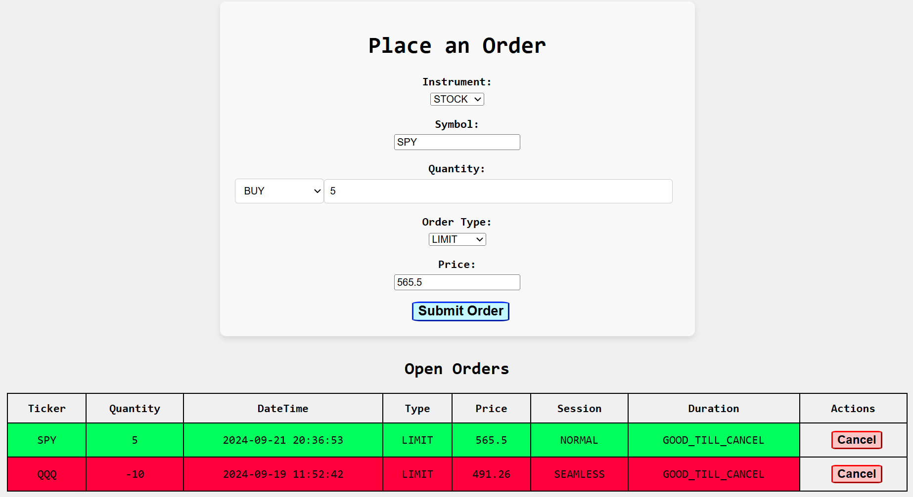

# Trading Platform Overview
A React frontend with Flask backend website made to analyze trades, see current positions, and place orders in a Schwab Brokerage Account. 

## Uses
As recent as [August 5th 2024](https://www.nytimes.com/2024/08/05/business/charles-schwab-fidelity-online-brokerage-outages.html#:~:text=Aug.%205%2C%202024.%20Online%20stock%20trading%20platforms%2C,said%20users%20had%20trouble%20logging%20into%20their), Schwab and other major brokerage platforms went down during the trading day which meant many people couldn't exceute trades. Setting up this platform is a process but it may be very useful in case these brokerage outages happen again. As long as your refresh token(which needs to be updated every 7 days) is valid, you **can place orders even when Schwab's app and website are down**.

Another use case would be **algorithmic trading**. The backend of this project has many endpoints and resources that are already setup. One could code their trading bot and then this program can help them connect with Schwab to directly place orders. In the future, I may add more support for automation.

### Setup
To edit this repo, install the necessary python modules and make sure to have react properly set up as well.

You will need to create an account and apply for a app via the **Schwab Developer API platform**. Once approved for the application, you can obtain the **app key** and the **app secret** from that website. You will have to then wait a few days for approval.

Then you can run transactions.py and it will prompt you to login. Log in, press done and then copy the link at the top of that page that says failed to connect. Within 30 seconds or so, paste that link into the terminal(there will be a prompt). Once that is done, your **hash** will be displayed in the terminal when you run back.py

Next, create a **.env** file and place the following 4 variables there:

*app_key = "Your Schwab App Key"  
app_secret = "Your Schwab App's Secret(essentially a password)"  
hash = "Your Account Number's Hash Value(alphanumeric)"  
callback_url = "https://127.0.0.1"* 

Big thanks to Tyler Bowers, as flask/api.py and flask/color_print.py were reused from his excellent github repo for the Schwab API. Here is his github for reference: https://github.com/tylerebowers. You can also use his youtube videos to get help for API related issues. 

Once you have finished creating a application from the developer account, you can run the program. To run the program, **open two terminals**, navigate to flask directory in one of them and type '''python back.py'''. In the other terminal, navigate to
client and type '''npm start'''. This should start the program and take you to the landing page.

You would need to have react properly setup in order to run this project. However, there is a common error that may not let you program work even with everything setup. To fix this, add **"proxy": "http://localhost:5000"** in **client/package.json** file if it isn't already there.

### Images Of Website
**Home/Landing** page which allows you to navigate to other pages

**Transactions** page which allows you to see transactions based on selected dates and an optional ticker filter

**Current Positions** page lets you to visualize your current open positions through two pie charts, one based on dollar value and the other percentage. At the bottom, you can also see your positions listed out in table similar to the transactions page

**Place order** page lets you place stock and option orders while also allowing you to see the current working orders and cancel them if necessary

